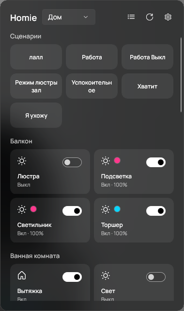
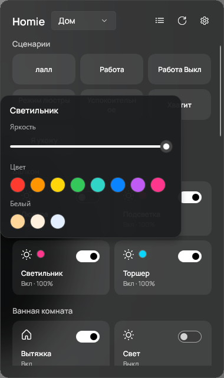
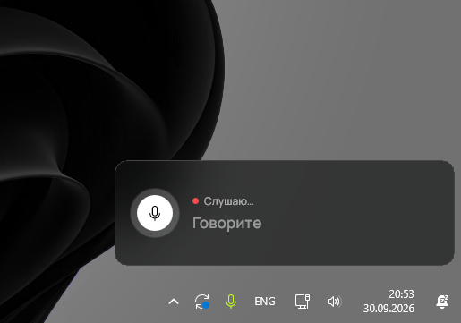
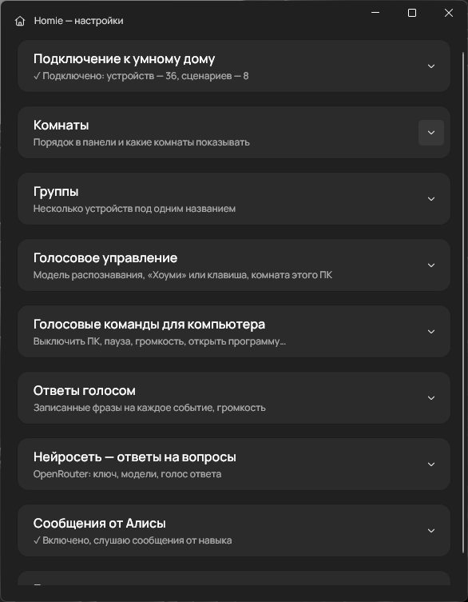

<div align="center">


# Homie

**Умный дом Яндекса — прямо на компьютере. С голосом, как у колонки.**

Свет, розетки, сценарии и датчики — из трея Windows, горячими клавишами или голосом:
«Хоуми, выключи свет», «Хоуми, пауза», «Хоуми, сколько до Луны?»


<br />


&nbsp;&nbsp;


</div>

---

## Зачем это

Колонка с Алисой стоит в одной комнате, телефон где-то рядом, а ты — за компьютером: в игре, на созвоне,
за работой. Homie делает компьютер ещё одной «колонкой» умного дома:

- **не надо тянуться к телефону** — дом управляется из трея, клавишей или голосом, даже из игры;
- **компьютер знает, где он стоит** — «выключи свет» выключает свет *в этой комнате*, как колонка;
- **голос распознаётся прямо на ПК** — ничего не отправляется в интернет, пока не спросишь нейросеть;
- **заодно управляет самим компьютером** — пауза видео, громкость, выключение, запуск программ.

## Что умеет

### 🏠 Панель умного дома в трее
Клик по домику — и все устройства по комнатам: плитками или списком, в стиле Windows 11 (акрил, скругления).

- включение/выключение, яркость, цвет и оттенки белого;
- показания датчиков: температура, влажность, CO₂, мощность — по наведению и в подробностях;
- **группы**: группы из приложения Яндекса встают в комнату своих устройств, а можно собрать и свои —
  например «Люстра» из левого и правого канала выключателя;
- сценарии — одной кнопкой или из меню трея;
- порядок комнат и скрытие ненужных.

### 🎙️ Голосовое управление
Работает **офлайн** (модель Vosk, ~45 МБ, скачивается по кнопке в настройках).



- слово **«Хоуми»**, клавиша «нажми и говори» — или и то и другое;
- окошко над треем, как у Алисы: видно, что идёт запись, и распознанный текст на лету;
- понимает комнаты, «везде», числа, цвета, группы и сценарии по названию;
- **ответы голосом** — записанными фразами (свои mp3 на каждое событие, несколько вариантов вперемешку).

| Скажи | Что будет |
|---|---|
| «Хоуми, выключи свет» | свет в комнате, где стоит ПК |
| «Хоуми, включи свет в зале» / «…везде» | в зале / во всём доме |
| «Хоуми, яркость пятьдесят», «сделай ярче» | яркость |
| «Хоуми, свет тёплый», «красный свет» | оттенок и цвет |
| «Хоуми, выключи люстру» | вся группа разом |
| «Хоуми, какая температура?» | показания датчиков |
| «Хоуми, запусти сценарий Ночь» | сценарий |

### 💻 Команды для компьютера
Свои фразы на любое действие — сколько угодно вариантов через запятую:

- пауза / продолжить видео или музыку, громче, тише, следующий трек;
- выключить, перезагрузить (с отсчётом 5 секунд и отменой), сон, блокировка, выключить экраны;
- открыть программу, файл или ссылку — например, «Хоуми, давай поиграем» запускает античит.

### 🧠 Ответы нейросети (по желанию)
Если фраза — не команда, Homie спросит нейросеть через [OpenRouter](https://openrouter.ai)
(есть бесплатные модели) и ответит голосом Microsoft «Светлана» — по предложениям, пока ответ ещё пишется.

### 📨 Сообщения от Алисы (по желанию)
«Алиса, попроси помощника Хоуми передать на балкон: ужин готов» — и компьютер скажет это голосом.
Через свой приватный навык, настройка по шагам — в [alice-skill](alice-skill/README.md).

### ⌨️ Горячие клавиши
Любое сочетание — на сценарий или вкл/выкл устройства. Работают из любой программы и игры.

## Установка

1. Скачай **`HomieApp-win-Setup.exe`** со страницы [Releases](https://github.com/trunjeee/Homie/releases/latest)
   и запусти — Homie установится (без прав администратора) и появится в трее, в «Пуске» и на рабочем столе.
2. «Запускать вместе с Windows» — в меню трея (правый клик по домику).

**Обновления приходят сами.** Homie проверяет GitHub раз в несколько часов, скачивает только изменения
и ставит их при следующем запуске — или сразу по пункту «Обновить» в меню трея. Настройки и токены при
обновлении и даже удалении программы сохраняются (они лежат отдельно, в `%LOCALAPPDATA%\Homie`).

Нужна Windows 10 (1809+) или Windows 11. Windows может предупредить «неизвестный издатель» — программа
не подписана сертификатом: «Подробнее» → «Выполнить в любом случае».
Без установки — архив `HomieApp-win-Portable.zip` в том же релизе: распакуй и запусти `Homie.exe`.

<details>
<summary>Собрать из исходников</summary>

1. Установи [.NET SDK 10](https://dotnet.microsoft.com/download/dotnet/10.0).
2. Склонируй и собери:
   ```bash
   git clone https://github.com/trunjeee/Homie.git
   cd Homie
   dotnet publish -c Release -o publish
   ```
3. Запусти `publish\Homie.exe`.

</details>

## Первая настройка

При первом запуске откроются настройки. Подключение к умному дому — через **своё** приложение Яндекса
(ключи в Homie не зашиты, у каждого свои):

1. Создай приложение на [oauth.yandex.ru](https://oauth.yandex.ru/client/new): платформа «Веб-сервисы»,
   Redirect URI `https://oauth.yandex.ru/verification_code`, права «Умный дом»: просмотр и управление устройствами.
2. Вставь его ClientID в Homie и нажми «Войти через Яндекс».
3. Яндекс покажет токен — вставь его в Homie и нажми «Сохранить».

Дальше, по желанию, в свёрнутых разделах настроек:




- **Голосовое управление** — скачать модель, выбрать «Хоуми» / клавишу, указать комнату этого ПК;
- **Ответы голосом** — свои записи на каждое событие (стандартные уже есть);
- **Нейросеть** — ключ OpenRouter;
- **Сообщения от Алисы** — свой навык, код копируется кнопкой.

## Приватность

- **Голос распознаётся на компьютере.** Запись никуда не уходит; наружу — только фразы, которые
  Homie не понял как команду, и только если включена нейросеть.
- **Токены и ключи — только у тебя.** Токен Яндекса, ключ OpenRouter и ключ связи с навыком хранятся
  в `%LOCALAPPDATA%\Homie`, зашифрованными Windows (DPAPI) — расшифровать их может только твоя учётная запись
  на этом ПК. В коде и в репозитории ключей нет.
- **Сообщения от Алисы подписаны.** Чужой не заставит твой ПК говорить: без ключа подпись не сойдётся.

## Частые вопросы

**Homie не слышит «Хоуми».** Модель может слышать слово по-своему. В настройках голоса есть строка
«Услышал: …» — добавь этот вариант в список через запятую.

**Клавиша «плей» на клавиатуре повторяла ответ Хоуми.** Исправлено: ответы Homie не считаются «мультимедиа»,
клавиша управляет видео и музыкой.

**Нейросеть пишет, что модель перегружена.** Бесплатные модели иногда заняты — Homie сам пробует запасные.
Список моделей можно поменять в настройках.

## Под капотом

WinUI 3 (Windows App SDK) · .NET 10 · [Vosk](https://alphacephei.com/vosk/) для офлайн-распознавания ·
NAudio · [API умного дома Яндекса](https://yandex.ru/dev/dialogs/smart-home/doc/ru/) ·
OpenRouter · Yandex Cloud Functions + [ntfy](https://ntfy.sh) для навыка Алисы.

Проект личный и неофициальный — Homie не связан с Яндексом.

## Лицензия

[MIT](LICENSE) — пользуйся, меняй и делись, указывая автора.
